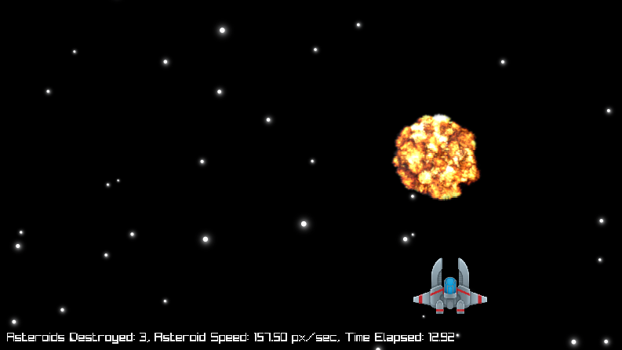

# Spaceship Survival

## Notes
### Collision
The collision between the spaceship and the asteroid is approximated with the collision of a rectangle and a circle. 

### Propulsion Sound
Initially, I set that if 'w' key stays pressed for more than the duration of the propulsion sound,
the latter was going to restart and loop. But, the restart of the sound was clearly hearable and ugly and so
I decided not to loop the sound once it finishes.  
P.S. I know in space there is no sound. Still, I wanted a propulsion sound :) 

### Attribution
[Sound Effect from Pixabay]("https://pixabay.com/?utm_source=link-attribution&utm_medium=referral&utm_campaign=music&utm_content=47562")
